# algo_trading

CLI implementation of the algorithmic trader test.

## Command description

**Usage**:   cli_interface.py [-h] [--verbose] strategies generators

**Positional arguments:** 
 - strategies  select the number of strategies
 - generators  select the number of generators

**Optional arguments:** 
  &nbsp;&nbsp;&nbsp; -h, --help  show this help message and exit 
  &nbsp;&nbsp;&nbsp; --verbose   enable output verbosity. If verbosity is not allowd logs will not be displayed and decisions will not show up. Only interactions with the strategies and generators would be available.
  
 **Example**
 
 python3 cli_interface.py 4 12 --verbose
 
 Creates 4 strategies with 12 generators each.
 
## System init
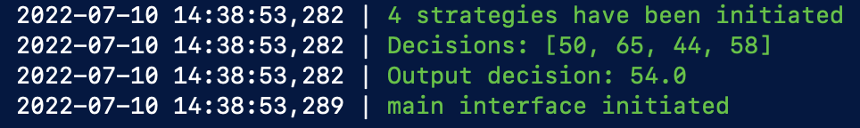
 
## Interface 
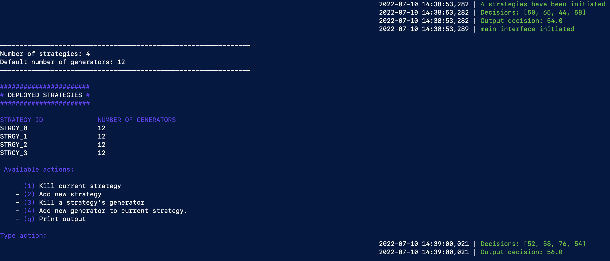

## Decision output
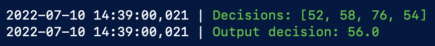

## Decisions update
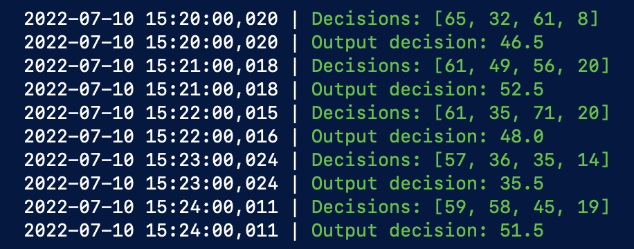

## Kill strategy flow
After selecting action 1 in the interface, a list of the currently available strategies is displayed. Then, the number of the strategy must be introduced to kill the strategy.  
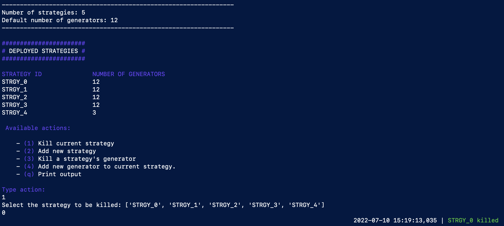
  Now information with the updated strategies is displayed.  
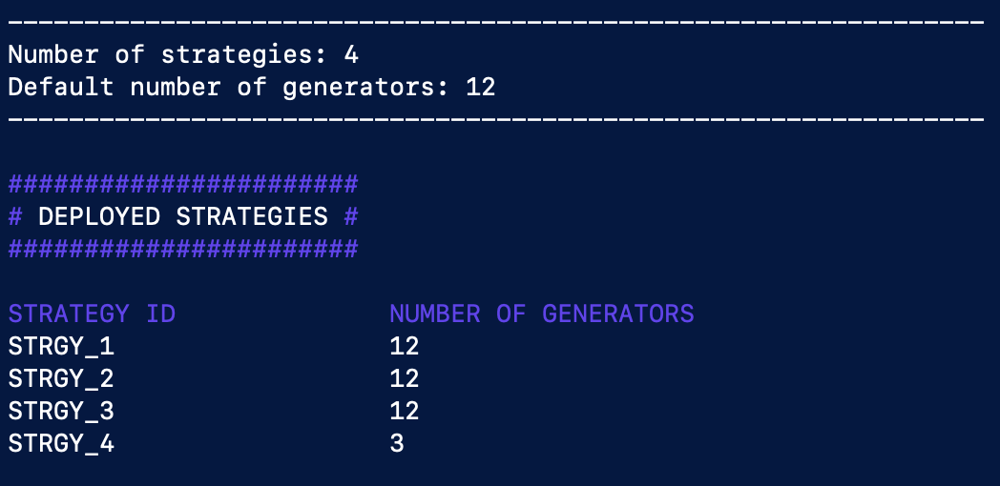

## Add strategy flow
After selecting action 2 in the interface, the number of generators of the new strategy must be indicated as input.  
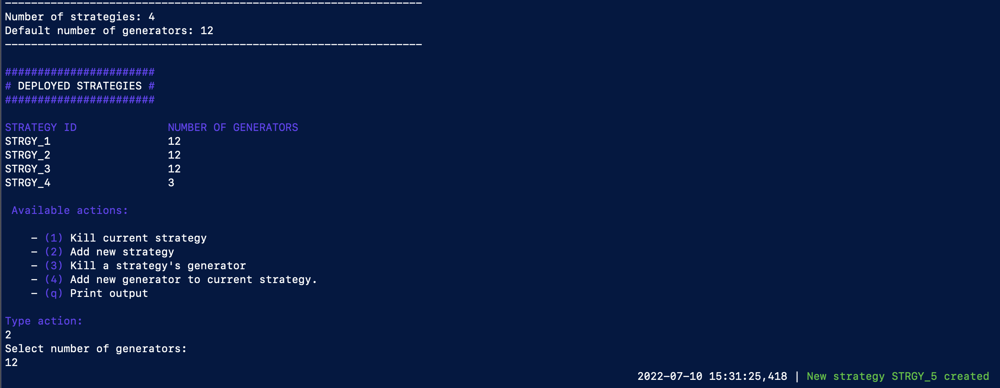
  Now information with the updated strategies is displayed.  
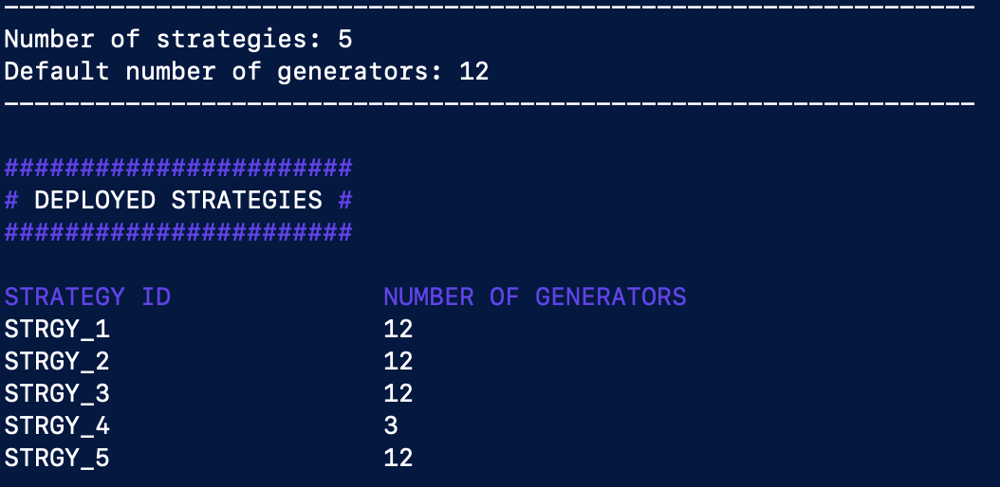

## Kill generator flow
After selecting action 3 in the interface,  a list of the currently available strategies is displayed. Then, the number of the strategy must be introduced. Then, a list displaying all the generators of the selected strategy wil be displayed. Finally, in order to kill the generator the number of one of the generators displyed in the previous step must be displayed.  
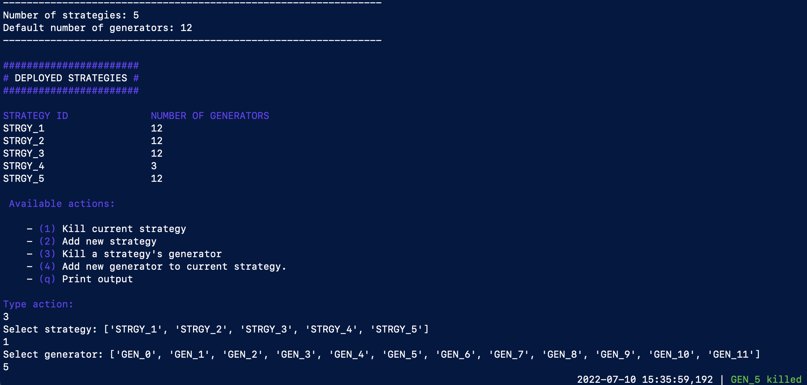
  Now information with the remaining updated is displayed.  
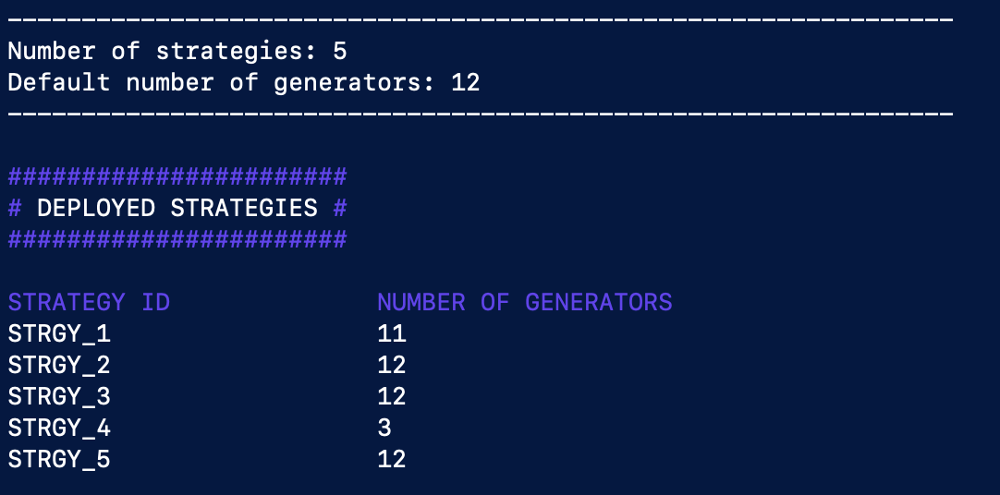

## Add generator flow
After selecting action 4 in the interface, a list of the currently available strategies is displayed. Then, the number of the strategy must be introduced and a new genrator will be added to this strategy.  
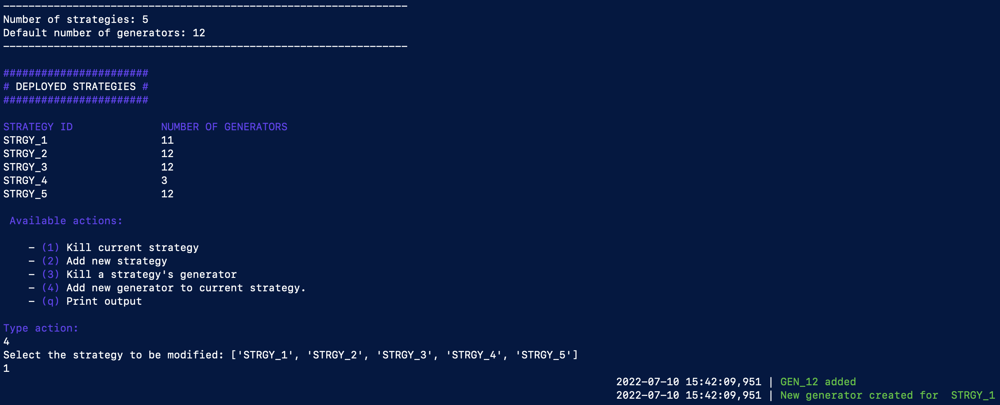
  Now information with the updated strategies is displayed.  
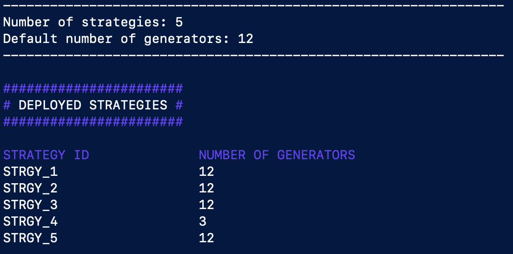
 
 ## Print output
 
 Decisions are updated every minute, this can make the interface to not fit in the window. To display the list of actions and strategy info type the action q.   
 
 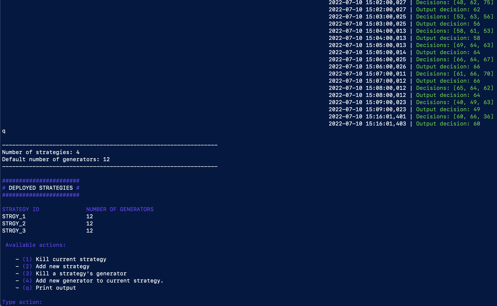
